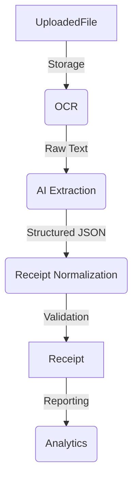

# 6. Processing Pipeline Architecture

Date: 2026-07-31

## Status

Accepted

## Context

ReceiptIQ ingest unstructured receipts and transforms them into structured data for querying and analytics. As we build out capabilities for OCR and AI-driven extraction, it is critical that future contributors and AI agents have a clear mental model of how data flows through the system to prevent coupling between independent stages.

## Decision

We will adhere to a strict sequential processing pipeline for all uploaded receipts. The pipeline separates raw storage, mechanical text extraction, semantic AI parsing, domain normalization, and downstream analytics.

The standard pipeline flow is as follows:

1. **UploadedFile**: A raw image or PDF is accepted, validated (MIME/size), checksummed, and saved to a `StorageProvider`. An `UploadedFile` record is created with status `UPLOADED`.
2. **OCR**: The file is passed to an OCR engine (abstracted behind an interface) which extracts raw text. The file's status transitions to `OCR_COMPLETE`.
3. **AI Extraction**: The raw text (and potentially the image) is passed to a Large Language Model (e.g., Gemini) to extract structured fields (Store Name, Total, Items). The status transitions to `AI_COMPLETE`.
4. **Receipt Normalization**: The structured JSON from the AI is validated against our Pydantic schemas and business rules (e.g., checking that subtotal + tax == total).
5. **Receipt**: A fully structured `Receipt` and its `ReceiptItem`s are committed to the primary database.
6. **Analytics**: The structured data becomes available for reporting, aggregation, and querying.

## Consequences

- **Pros:**
  - **Decoupling**: Each stage is completely isolated. We can swap OCR engines or AI models without affecting the entire pipeline.
  - **Resilience**: If AI extraction fails, we still have the `UploadedFile` and OCR text, allowing us to retry from the point of failure.
  - **Traceability**: We can easily trace where a receipt failed processing.
- **Cons:**
  - **State Management**: We must maintain processing statuses and handle intermediate states in the database.
  - **Asynchrony**: This pipeline will eventually require background job processors (e.g., Celery or background tasks) to prevent blocking the HTTP layer.
